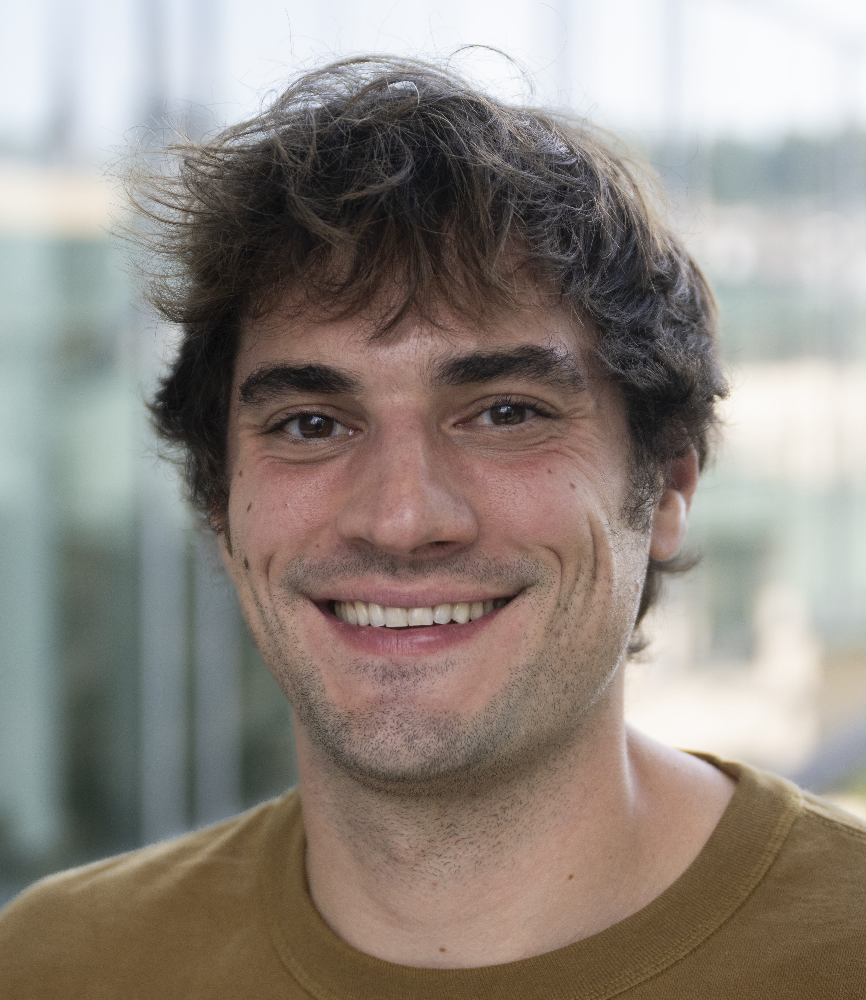

# about me

I was a Courant Instructor at the [Courant Institute of Mathematical Sciences](https://www.courant.nyu.edu/) from 2021-2024, where I worked primarily with [Eric Vanden-Eijnden](https://wp.nyu.edu/courantinstituteofmathematicalsciences-eve2/).

I completed my PhD at Harvard University in applied mathematics, where I was co-advised by [Jean-Jacques Slotine](https://scholar.google.com/citations?user=TcREpMQAAAAJ&hl=en&oi=ao) and [Chris Rycroft](https://scholar.google.com/citations?user=IS_xUuIAAAAJ&hl=en&oi=ao). I also collaborated with [Ariel Amir](https://www.weizmann.ac.il/complex/amir/home). I spent roughly half of my time at Harvard and half of my time at MIT. My thesis work focused on various problems in computational mathematics and machine learning, including adaptive control and learning in nonlinear dynamical systems, numerical method development for partial differential equations, and stochastic simulation of evolutionary dynamics.

During the last year of my PhD, I was also a student researcher at Google Brain, where I had the pleasure of working with [Vikas Sindhwani](https://vikas.sindhwani.org/) and [Stephen Tu](https://stephentu.github.io).

From 2015-2019, my research was funded by a Department of Energy Computational Science Graduate Fellowship. I spent my practicum at Berkeley.

From 2014-2015, I was a Fulbright Scholar at Tel Aviv University. While there, I focused on the development of numerical methods for quantum chemistry.

Before graduate school, I was an undergraduate at Northwestern University, where I studied mathematics, physics, and [integrated science](https://isp.northwestern.edu/). I spent four wonderful years working on problems in theoretical chemistry with [Tamar Seideman](https://sites.northwestern.edu/seideman/).
