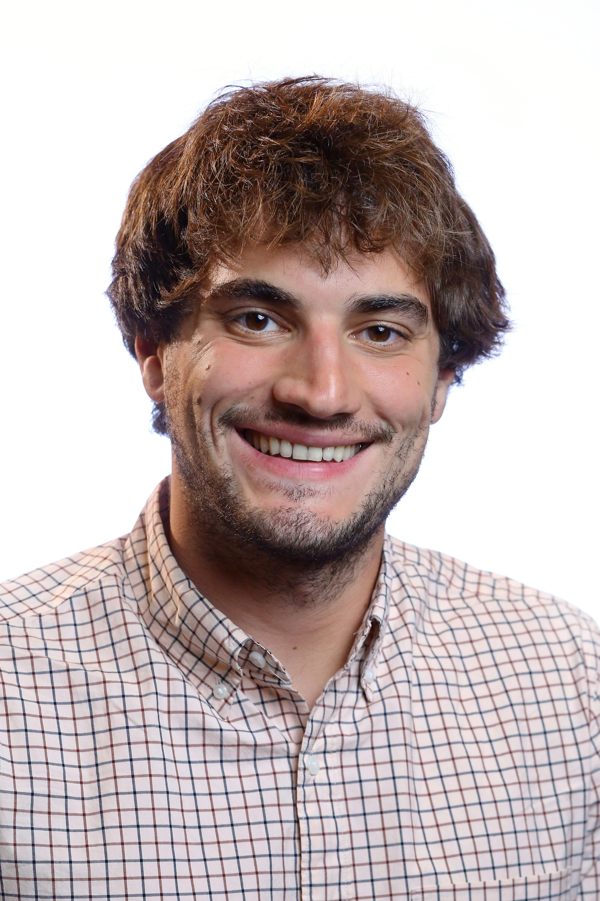

# nicholas m. boffi

I’m a sixth-year PhD student in applied mathematics at Harvard University, where I am co-advised by [Chris Rycroft](http://people.seas.harvard.edu/~chr/research/) (Harvard University) and [Jean-Jacques Slotine](http://web.mit.edu/nsl/www/) (MIT). I am also a student researcher at Google Brain Robotics, hosted by [Vikas Sindhwani](https://vikas.sindhwani.org/). I am broadly interested in nonlinear dynamical systems, control theory, machine learning, optimization, numerical analysis, and computational mathematics. My research focuses on the use of machine learning methods in adaptive control theory and the application of dynamical systems techniques to optimization and machine learning.

Before attending Harvard, I was an undergraduate at Northwestern University, where I was a triple major in mathematics, physics, and [integrated science](https://isp.northwestern.edu/). I was advised by [Tamar Seideman](https://sites.northwestern.edu/seideman/), and my research focused on problems at the interface of condensed matter physics and atomic, molecular, and optical physics. From 2014-2015, I was a Fulbright Scholar at Tel-Aviv University in Israel working with Amir Natan, where I focused on developing efficient numerical methods for quantum mechanical simulations.

From 2015-2019, my research was funded by a Department of Energy Computational Science Graduate Fellowship.
