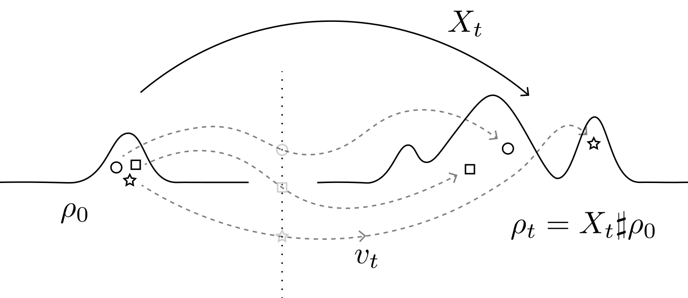
Rooted in the theory of optimal transport, dynamical transport of measure studies the time-evolution of a probability distribution from two complementary perspectives: an Eulerian perspective, whereby a partial differential equation describes the evolution of the measure itself, and a Lagrangian perspective, whereby an ordinary or stochastic differential equation describes the evolution of samples. We develop methods for high-dimensional scientific computing and for generative modeling built upon dynamical transport of measure.

<!-- ## high-dimensional scientific computing -->
<h2 style="text-align: right;">high-dimensional scientific computing</h2>
Many problems in scientific computing and computational mathematics are naturally high-dimensional. A canonical example arises in modeling the statistical physics of interacting particle systems, where high-dimensionality appears due to a large number of interacting constitutive elements. A standard method to study these systems is to model their dynamics with a stochastic differential equation, which can be numerically integrated and used to compute expectation values via the Monte-Carlo method. However, a wealth of additional information inaccessible from SDE trajectories alone is contained in the microscopic density for the system, which solves a Fokker-Planck equation (FPE) describing transport of measure by the system's stochastic dynamics. One notable example for nonequilibrium systems such as driven systems or those arising in active matter is the entropy production rate (EPR), which quantifies the relevance of nonequilibrium effects. However, the FPE is too high-dimensional for standard numerical techniques in all but simplified toy systems, making computation of the EPR intractable. 

In collaboration with Professor Eric Vanden-Eijnden at the Courant Institute, we have designed neural network-based methods for both the time-dependent and the stationary FPE that scale to realistic system sizes. We are currently interested in further developing these methods to investigate poorly-understood active matter systems, to optimize over energy dissipation in driven, time-dependent nonequilibrium systems, and to extend the approach beyond Fokker-Planck to other classes of high-dimensional partial differential equations.

  

    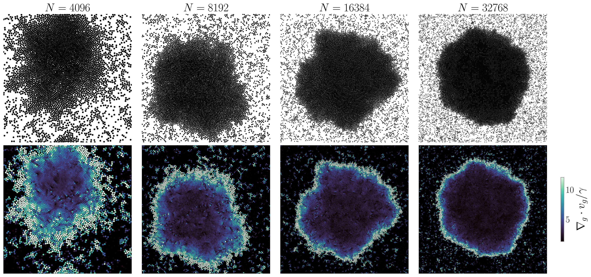
  

1. N. M. Boffi and Eric Vanden-Eijnden. "Deep learning probability flows and entropy production rates in active matter." arXiv:2309.12991, 2023. [arXiv](https://arxiv.org/abs/2309.12991)
1. N. M. Boffi and Eric Vanden-Eijnden. "Probability flow solution of the Fokker-Planck equation," Machine Learning: Science and Technology (2023). [journal](https://iopscience.iop.org/article/10.1088/2632-2153/ace2aa/meta) / [arXiv](https://arxiv.org/abs/2206.04642)

## generative modeling
Generative modeling studies the problem of sampling from a target probability distribution given a set of examples. Many stunning demos exist in modern popular culture for generating images from text, such as [stable diffusion](https://stability.ai), [midjourney](https://www.midjourney.com/home/?callbackUrl=%2Fapp%2F), and [DALL-E](https://openai.com/dall-e-3). In collaboration with Professor Eric Vanden-Eijnden (Courant Institute) and PhD student Michael Albergo (NYU Physics), we have developed a theory of *stochastic interpolants*, a generalization of current state-of-the-art diffusion models. Stochastic interpolants generate new samples from the target probability distribution by dynamically pushing samples from a simple base distribution using an efficiently learnable dynamical system.

We have shown how stochastic interpolants can be built upon either ordinary differential equations (leading to a transport equation for the measure) or stochastic differential equations (leading to a Fokker-Planck equation for the measure), and have categorized the tradeoffs between both approaches. In collaboration with PhD student Mark Goldstein (NYU Computer Science), we have also extended the method to coupled base and target densities, enabling solution of inpainting and super-resolution problems. We are currently interested in developing generative modeling methods for high-dimensional scientific computing, including problems in dynamical forecasting and coarse-graining of complex systems, sampling molecular configurations, and designing interpolants that connect the base and target via physically-motivated paths.

  

    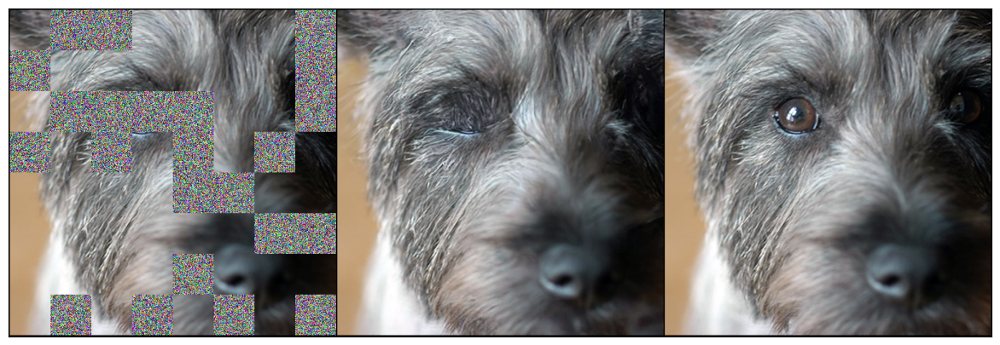
  

1. Michael S. Albergo, Mark Goldstein, N. M. Boffi, Rajesh Ranganath, and Eric Vanden-Eijnden. "Stochastic interpolants with data-dependent couplings." arXiv:2310.03725, 2023. [arXiv](https://arxiv.org/abs/2310.03725)
1. Michael S. Albergo, N. M. Boffi, Michael Lindsey, and Eric Vanden-Eijnden. "Multimarginal generative modeling with stochastic interpolants." arXiv:2310.03695, 2023. [arXiv](https://arxiv.org/abs/2310.03695)
1. Michael S. Albergo\*, N. M. Boffi\*, and Eric Vanden-Eijnden. "Stochastic Interpolants: A Unifying Framework for Flows and Diffusions." arXiv:2303.08797 (2023). [arXiv](https://arxiv.org/abs/2303.08797)

---

<h1 style="text-align: right;">dynamical systems and machine learning</h1>

  

    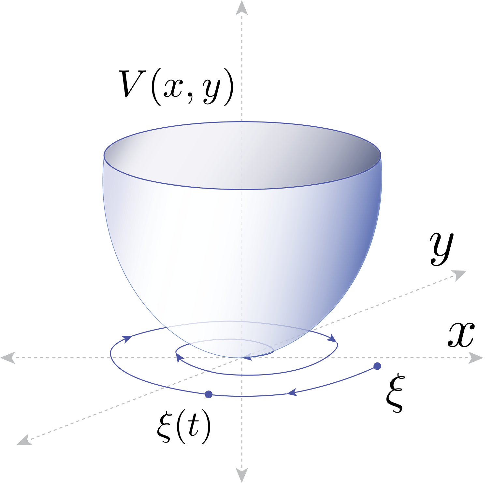
  

  

    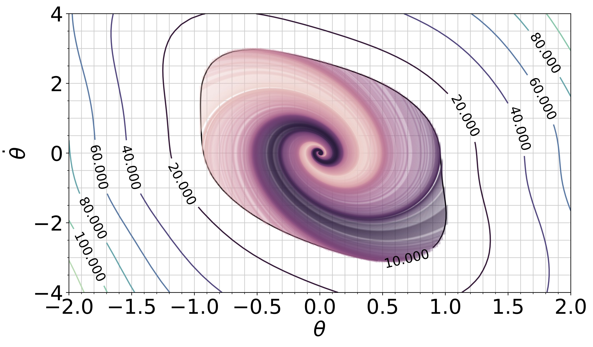
  

For many nonlinear dynamical systems, learning a control input online to counteract modeling errors and unforeseen disturbances can offer significant performance improvements at little computational cost. Online learning can be used independently, or can be combined with an offline learning phase (for example, implemented with reinforcement learning) to improve robustness to distribution shift. The field of nonlinear adaptive control studies the design of online learning mechanisms that are provably convergent, and that guarantee stability of the joint learning and system dynamics. 

In collaboration with Professor Jean-Jacques Slotine (MIT), Professor Stephen Tu (University of Southern California, previously at Google Brain), and Dr. Vikas Sindhwani (Google DeepMind), we have developed new adaptive algorithms that leverage recent advances in machine learning, such as implicit regularization, regret bounds, nonparametric function classes, and learning of adaptive laws directly from data. We have also shown how continuous-time proof techniques from nonlinear control can be used to obtain guarantees for machine learning algorithms.

  

    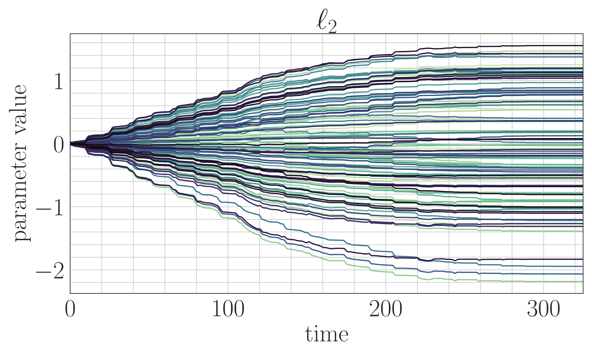
  

  

    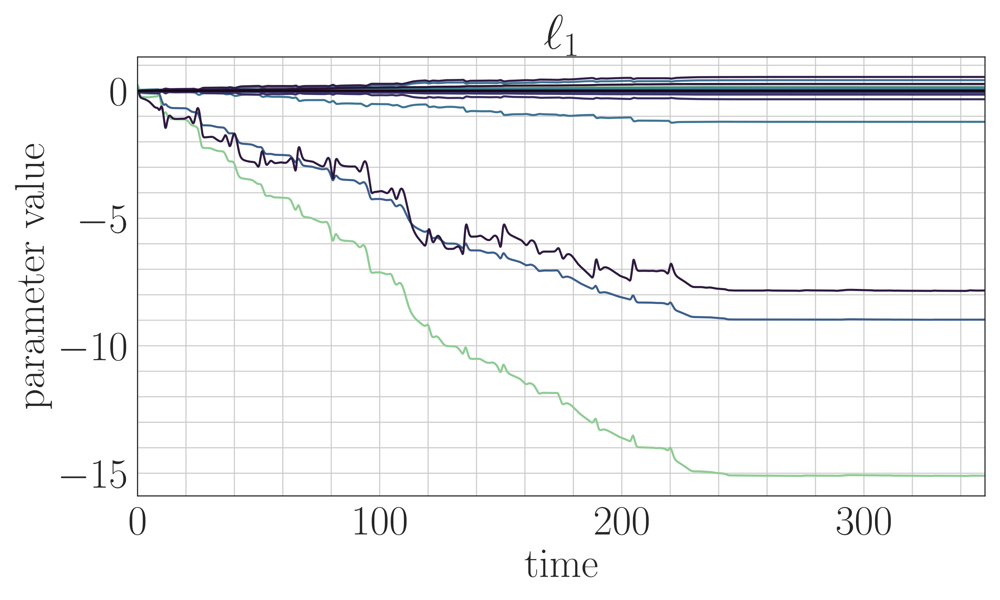
  

1. Saminda Abeyruwan, Alex Bewley, N. M. Boffi, Krzysztof Marcin Choromanski, David B D’Ambrosio, Deepali Jain, Pannag R Sanketi, Anish Shankar, Vikas Sindhwani, Sumeet Singh, Jean-Jacques Slotine, Stephen Tu. "Agile Catching with Whole-Body MPC and Blackbox Policy Learning," Learning for Dynamics and Control (L4DC) 2023. [conference](https://proceedings.mlr.press/v211/abeyruwan23a.html)
1. N. M. Boffi\*, Stephen Tu\*, and Jean-Jacques Slotine. "Non-parametric adaptive control and prediction: theory and randomized algorithms," Journal of Machine Learning Research 23 (2022) 1-46. [journal](https://www.jmlr.org/papers/volume23/22-0022/22-0022.pdf) / [conference](https://ieeexplore.ieee.org/abstract/document/9682907/) / [arXiv](https://arxiv.org/abs/2106.03589)
1. Thomas Zhang, Stephen Tu, N. M. Boffi, Jean-Jacques Slotine, and Nikolai Matni. "Adversarially robust stability certificates can be sample efficient," Learning for Dynamics and Control (L4DC 2022). [conference](https://proceedings.mlr.press/v168/zhang22a.html) / [arXiv](https://arxiv.org/abs/2112.10690)
1. N. M. Boffi\*, Stephen Tu\*, Jean-Jacques E. Slotine, "The role of optimization geometry in single neuron learning," International Conference on Artificial Intelligence and Statistics (2022). [conference](https://proceedings.mlr.press/v151/boffi22a.html) / [arXiv](https://arxiv.org/abs/2006.08575)
1. N. M. Boffi\*, Stephen Tu\*, Jean-Jacques E. Slotine, "Regret bounds for adaptive nonlinear control," Learning for Dynamics and Control (L4DC 2021). **selected for oral presentation**. [conference](https://proceedings.mlr.press/v144/boffi21a.html) / [arXiv](https://arxiv.org/abs/2011.13101)
1. N. M. Boffi\*, Stephen Tu\*, Nikolai Matni, Jean-Jacques E. Slotine, Vikas Sindhwani, “Learning stability certificates from data,” Conference on Robot Learning (CoRL) 2020. [conference](https://corlconf.github.io/paper_290/) / [arXiv](https://arxiv.org/abs/2008.05952)
1. N. M. Boffi, Jean-Jacques E. Slotine, "Implicit regularization and momentum algorithms in nonlinearly parameterized adaptive control and prediction," Neural Computation, 33(3):590-673, 03 2021. **featured on the cover**. [journal](https://direct.mit.edu/neco/article-abstract/33/3/590/97492/Implicit-Regularization-and-Momentum-Algorithms-in?redirectedFrom=fulltext) / [arXiv](https://arxiv.org/abs/1912.13154)
1. N. M. Boffi, Jean-Jacques E. Slotine, “A continuous-time analysis of distributed stochastic gradient,” Neural Computation 32, 36-96 (2020). [journal](https://www.mitpressjournals.org/doi/abs/10.1162/neco_a_01248) / [arXiv](https://arxiv.org/abs/1812.10995)

---

# scientific computing
We develop numerical algorithms and high-performance implementations to solve modeling problems across the sciences and engineering. We release our simulation software for use by the community.

## population genetics

  

    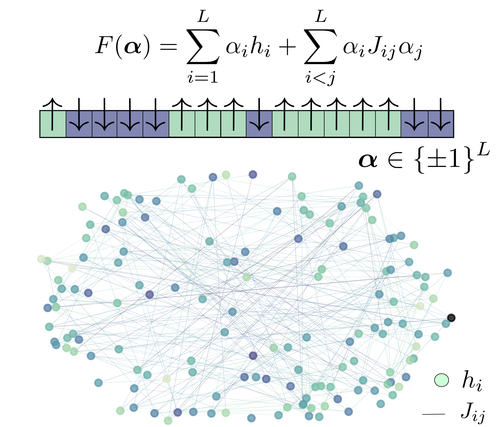
  

  

    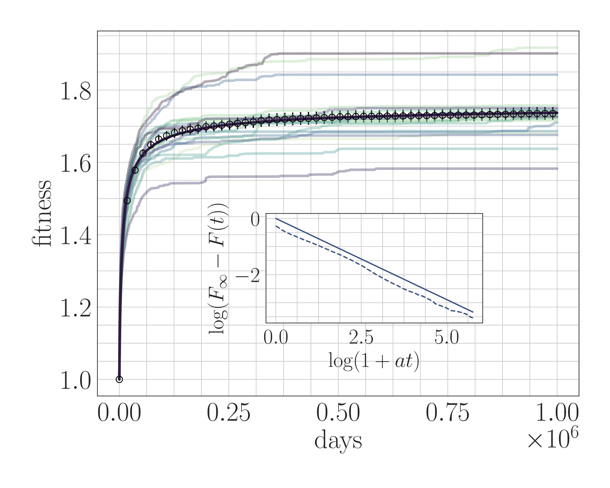
  

Understanding the natural processes that drive evolution in living organisms is a fundamental problem in mathematical biology, but many basic aspects are still poorly understood. Laboratory experiments have demonstrated the widespread prevalence of microscopic epistasis (the dependence of a mutation's effect on the genotype) and clonal interference (competition between strains) in standard evolving microbial cultures. Yet, these aspects are often neglected in mathematical and computational studies due to their complexity, so their effect on real-world evolving populations is unclear. 

In collaboration with Professor Ariel Amir (Harvard University, now at Weizmann Institute), Professor Chris Rycroft (Harvard University, now at University of Wisconsin Madison), and graduate student Yipei Guo (Harvard University, now at Janelia), we have developed a genome-level microscopic simulation environment for population genetics based on spin glass physics. We have scaled the environment to match the experimental conditions of [Richard Lenski's seminal experiment](https://en.wikipedia.org/wiki/E._coli_long-term_evolution_experiment), and have applied it to understand the effects of microscopic epistasis and clonal interference.

1. N. M. Boffi, Yipei Guo, Chris H. Rycroft, Ariel Amir. "How microscopic epistasis and clonal interference shape the fitness trajectory in a spin glass model of microbial long-term evolution," eLife 12 (2023). [journal](https://elifesciences.org/reviewed-preprints/87895) / [biorXiv](https://www.biorxiv.org/content/10.1101/2023.01.16.524306v1)

<h2 style="text-align: right;">modeling of amorphous materials and metallic glasses</h2>

  

    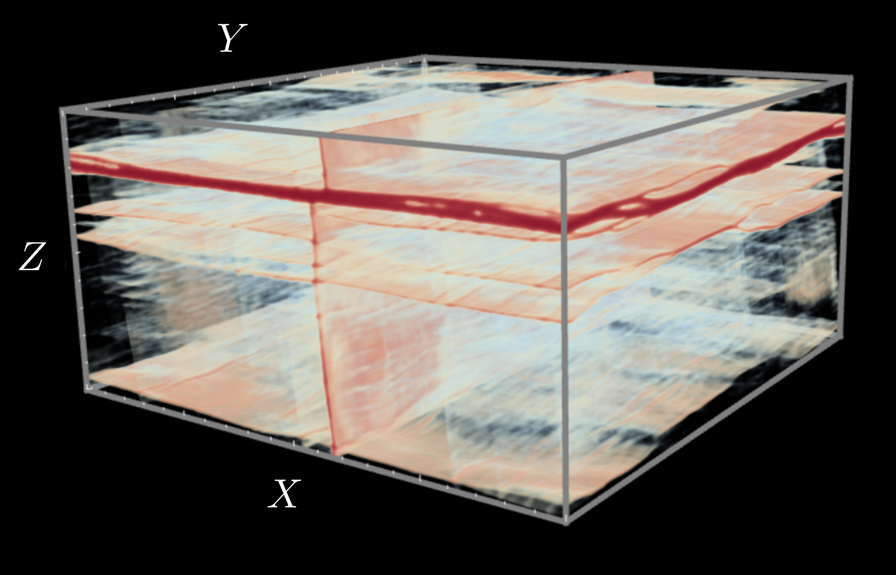
  

  

    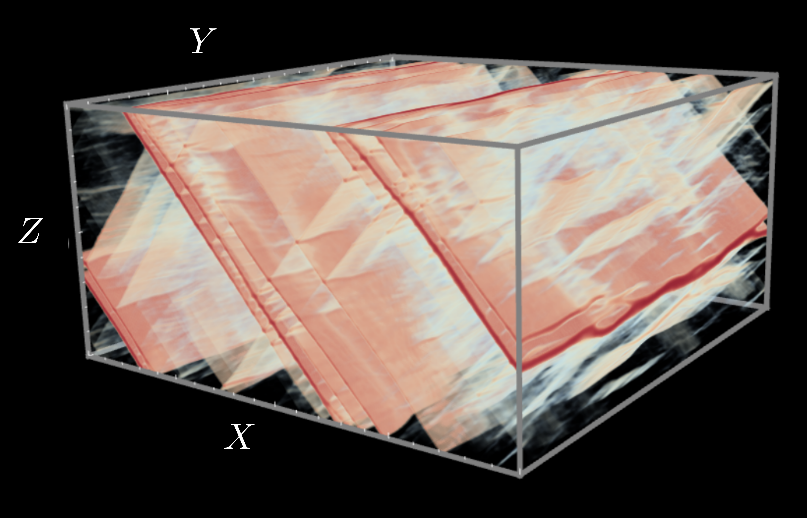
  

Many materials of scientific and engineering relevance exhibit *elastoplastic* behavior, which consists of reversible, elastic deformation below a yield stress, and irreversible, plastic deformation above this threshold. One prominent example is bulk metallic glass (BMG), a class of metallic alloy with an amorphous atomic-scale structure rather than the crystalline arrangement common to most metals. Their disordered structure gives BMGs many promising characteristics, such as high corrosion and wear resistance, and the ability to be thermally processed like plastics. Despite this, BMGs are not widely used in applications, as they often fail along a narrow localization of stress known as a shear band, a poorly understood instability. 

In collaboration with Professor Chris Rycroft at Harvard University (now at University of Wisconsin Madison), we have developed efficient three-dimensional projection algorithms for simulating elastoplastic deformation in the quasi-static limit. We have applied the methods to study shear band formation in BMGs, to match boundary conditions between continuum and atomistic simulation, and to learn coarse-grainings for atomistic simulations.

1. Katiana Kontolati, Darius Alix-Williams, N. M. Boffi, Michael L. Falk, Chris H. Rycroft, and Michael D. Shields. "Manifold learning for coarse-graining atomistic simulations: Application to amorphous solids," Acta Materialia, 215:1170008 (2021). [journal](https://www.sciencedirect.com/science/article/pii/S1359645421003888?casa_token=XTA7UrT9sm4AAAAA:vhoCkbtfgmyMECwOase6qvdob-mNXydktT7sRGMu79eskMPmlFF05yOt-b6jBbDnC2XboPP0ww) / [arxiv](https://arxiv.org/abs/2103.00779)
1. N. M. Boffi, Chris H. Rycroft, “Coordinate transformation methodology for simulating quasi-static elastoplastic solids,” Physical Review E 101, 053304 (2020). [journal](https://journals.aps.org/pre/abstract/10.1103/PhysRevE.101.053304) / [arXiv](https://arxiv.org/abs/1904.04145)
1. N. M. Boffi, Chris H. Rycroft, “Parallel three-dimensional simulations of quasi-static elastoplastic solids,” Computer Physics Communications 257, 107254 (2020). [journal](https://www.sciencedirect.com/science/article/pii/S0010465520300795?via%3Dihub) / [arXiv](https://arxiv.org/abs/1904.03808)

## quantum chemistry
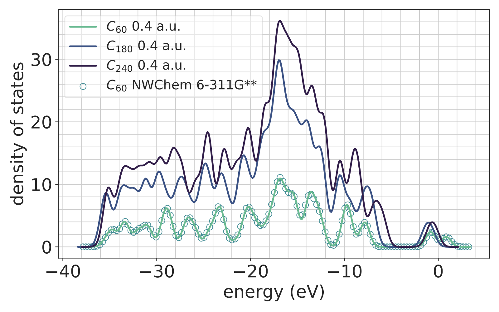

Density functional theory is frequently used to compute ground-state electronic properties of condensed matter systems. Hybrid functionals, which mix a fraction of the Hartree-Fock exchange with standard exchange-correlation functionals, have shown impressive success in predicting experimentally-determined electronic properties, but are often implemented using *ad-hoc* basis sets. Classical methods from numerical analysis offer a compelling alternative, as their convergence and accuracy can be guaranteed rigorously, but they often come with high computational expense. 

In collaboration with Professor Amir Natan at Tel Aviv University, we have developed methods that compute the Hartree-Fock exchange in real-space by projection onto occupied states, significantly improving efficiency over naive real-space approaches.

1.  N. M. Boffi, Manish Jain, Amir Natan, “Efficient computation of the Hartree-Fock Exchange in real-space with projection operators,” Journal of Chemical Theory and Computation 12, (8) (2016). [journal](https://pubs.acs.org/doi/full/10.1021/acs.jctc.6b00376)
1.  N. M. Boffi, Manish Jain, Amir Natan, “Asymptotic behavior and interpretation of virtual states: the effects of confinement and of basis sets,” Journal of Chemical Physics 144, 084104 (2016). [journal](https://aip.scitation.org/doi/abs/10.1063/1.4942187?journalCode=jcp)
